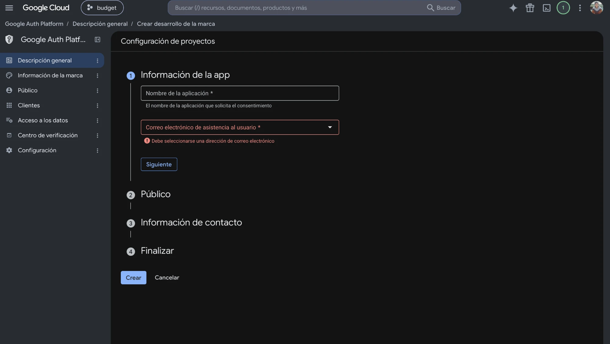
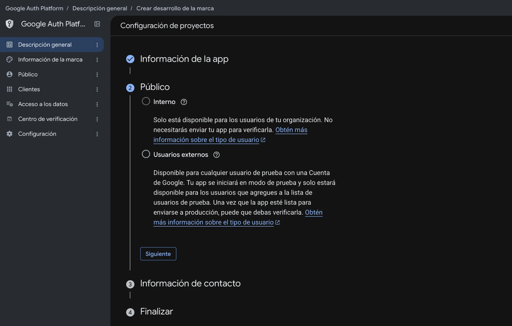
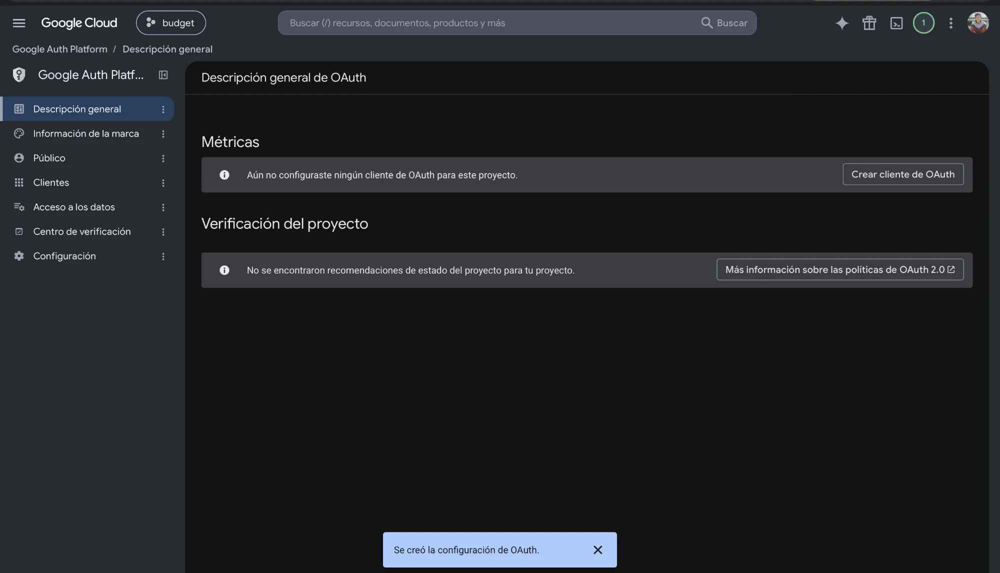

# Guía de uso — Budget Tracker

## 1. Descargar e instalar

1. Abre la app **Terminal** (Cmd+Espacio, escribe "Terminal", Enter).
2. Pega este comando completo y presiona Enter:

```
[ -d ~/Documents/budget-tracker ] || (mkdir -p ~/Documents && curl -fsSL https://github.com/vortizleon/budget-tracker/archive/refs/heads/main.tar.gz | tar -xz -C ~/Documents && mv ~/Documents/budget-tracker-main ~/Documents/budget-tracker); bash ~/Documents/budget-tracker/Instalar.command
```

Eso descarga la app a `Documents/budget-tracker` y corre el instalador.
Se usa Terminal (y no el ZIP del navegador) porque Mac bloquea los archivos
descargados desde el navegador; así no aparece ningún aviso de seguridad.

---

## 2. Qué esperar del instalador

- Trabaja solo. Instala `uv` (que baja Python) y los componentes de la app.
  **No pide contraseña, no necesita Homebrew ni las herramientas de Xcode, y
  no requiere actualizar macOS.** Todo es LOCAL en tu computadora.
- En algún momento se detiene y dice que falta el archivo `credentials.json`.
  Es normal: eso es el siguiente paso (sección 3). Cierra la ventana.
- Cuando tengas `credentials.json`, haz doble clic en `Instalar.command`
  (en la carpeta `Documents/budget-tracker`) y sigue donde quedó. Es seguro
  repetirlo las veces que haga falta.

---

## 3. Configura tu proyecto de Google

Esta es la única parte que **cada persona tiene que hacer por su cuenta**.
Gmail no permite que una sola app lea el correo de varias personas distintas
sin que cada quien autorice su propio acceso — por eso cada quien necesita
su propio "proyecto" en Google Cloud. Toma unos 5 minutos y es gratis.

Usa la cuenta de Gmail de donde quieres leer los correos del banco. Cada
enlace de abajo te lleva directo a la pantalla que necesitas (puede pedirte
iniciar sesión primero).

1. Crea el proyecto: entra a
   **https://console.cloud.google.com/projectcreate**
   - **Nombre del proyecto:** `Budget Tracker` (o el que quieras).
   - **Recurso superior / Ubicación:** déjalo en **Sin organización**.
   - Clic en **Crear**.

   Te lleva al panel de Google Cloud ("Vista general de Cloud"). **Ignora
   todo lo que aparece ahí**: el banner de "Comienza tu prueba gratuita" y
   el botón **Comenzar gratis** (no necesitas facturación ni tarjeta; Gmail
   API es gratis) y el aviso de "Cloud Hub". Solo confirma que arriba, junto
   al logo de Google Cloud, aparezca el nombre de tu proyecto. Si tienes
   más de un proyecto, revisa que sea ese y no otro.
2. Habilita Gmail API: con el proyecto seleccionado, entra a
   **https://console.cloud.google.com/apis/library/gmail.googleapis.com**
   y haz clic en el botón azul **Habilitar** (Enable). Espera unos segundos:
   cuando termine, la página "Detalles del servicio o la API" muestra
   **Estado: Habilitada**. **No** hagas clic todavía en el botón
   "Crear credenciales" que aparece arriba; primero va el paso 3.
3. Configura Google Auth Platform (antes llamada "pantalla de consentimiento
   de OAuth"): entra a **https://console.cloud.google.com/auth/overview** y
   haz clic en **Comenzar** (Get started). Es un asistente de 4 pantallas:
   - **Información de la app:** en "Nombre de la aplicación" escribe
     `Budget Tracker`. En "Correo electrónico de asistencia al usuario" es
     una lista desplegable: ábrela y elige tu correo (si lo dejas vacío
     marca error en rojo). Clic en **Siguiente**.

     
   - **Público:** elige **Usuarios externos** (no "Interno"; "Interno" solo
     sirve para cuentas de empresa/organización de Google). Dice que tu app
     "se iniciará en modo de prueba": es lo que queremos. Clic en
     **Siguiente**.

     
   - **Información de contacto:** escribe o elige tu correo (es donde Google
     te avisaría de cambios en el proyecto) → **Siguiente**.
   - **Finalizar:** marca la casilla de aceptar la política de datos de
     usuario de los servicios de las API de Google y guarda con
     **Continuar** / **Crear**.

   Cuando termine, ves la pantalla "Descripción general de OAuth" con un
   aviso azul abajo que dice **"Se creó la configuración de OAuth"**. Que
   diga "Aún no configuraste ningún cliente de OAuth" es normal, eso va en el
   paso 5.

   
4. Agrégate como usuario de prueba: en el menú de la izquierda, entra a
   **Público** (Audience) (o ve a
   **https://console.cloud.google.com/auth/audience**), baja a **Usuarios de
   prueba** (Test users) → **Add users** → agrega tu propio correo de Gmail →
   **Guardar**. El estado de publicación debe quedar en **Testing**
   (déjalo así). Si te saltas este paso, Google te bloquea más adelante con
   un error de "acceso no verificado".
5. Crea las credenciales: en el menú de la izquierda, entra a **Clientes**
   (Clients) (o ve a **https://console.cloud.google.com/auth/clients**) →
   **Crear cliente** (Create client).
   - Tipo de aplicación: **Aplicación de escritorio** (Desktop app).
   - Ponle el nombre que quieras → **Crear**.
   - No hace falta tocar "Acceso a los datos" (Data Access) ni agregar
     permisos: la app los pide sola al conectar Gmail.
6. Te va a aparecer una ventana con tu ID de cliente — haz clic en **Descargar
   JSON**. (Si la cerraste: en **Clientes**, clic en el nombre del cliente
   que creaste → **Descargar JSON**.)
7. Ve a tu carpeta de **Descargas** y busca ese archivo (algo como
   `client_secret_123456.json`):
   - Renómbralo a exactamente: **`credentials.json`**
   - Muévelo a la carpeta de la app (`Documents/budget-tracker`), justo al
     lado de `Instalar.command`.
8. Vuelve a la sección 2: haz doble clic en **`Instalar.command`** otra vez.

> **Nota:** Google cambia estas pantallas de vez en cuando. Si algo no se ve
> igual, busca el equivalente por el nombre del botón; los pasos siempre son:
> habilitar Gmail API → configurar la pantalla de consentimiento (Usuarios externos) →
> agregarte como usuario de prueba → crear un cliente de escritorio →
> descargar el JSON.

---

## 4. Agregar tus tarjetas (desde el navegador, sin Terminal)

El instalador crea solo, sin preguntarte nada, las categorías por defecto y
agrega los correos de BAC y Promerica desde donde la app ya sabe leer
transacciones — no tienes que saber de antemano cuáles son esas direcciones.
Después abre automáticamente el panel de la app en tu navegador
(`localhost:8000`).

Ahí te faltan dos cosas, ambas con clics normales, nada de Terminal:

**A. Agrega tus tarjetas.** Ve a la pestaña **Cards** (menú de la
izquierda) → **+ Add Card**, una vez por cada tarjeta que quieras rastrear:
- Nombre → el que quieras, ej. `BAC Visa`
- Últimos 4 dígitos de la tarjeta
- Tipo → Credit o Debit
- Banco → BAC o Promerica
- Si maneja colones y/o dólares, marca las casillas correspondientes
- Fecha de pago / límite de crédito son opcionales, déjalos en blanco si
  no los sabes de memoria

**B. (Opcional) ¿Bancos distintos a BAC o Promerica?** Ve a la pestaña
**Settings** → sección **Email Sources** → **+ Add Email Source**. Ahí
mismo te explica que lo que pides es la dirección *desde donde el banco te
manda* los avisos — no tu propio correo.

---

## 5. Primera sincronización

En la pestaña **Settings**, en la sección **Sync Status**, haz clic en el
botón **Sync Now**.

La primera vez se va a abrir tu navegador pidiéndote iniciar sesión con la
cuenta de Gmail que usaste en el paso 3, y dar permiso de **solo lectura**
sobre tu correo (la app nunca puede enviar correos ni borrar nada).

Vas a ver una pantalla de Google que dice algo como **"Google no verificó
esta app"**. Es normal — es tu propio proyecto, hecho solo para ti, y Google
muestra esa advertencia para cualquier app que no pasó su proceso de
verificación comercial. Haz clic en **Avanzado** → **Ir a Budget Tracker
(no seguro)** → **Permitir**.

Después de eso va a aparecer un mensaje en la esquina de la pantalla
diciendo cuántas transacciones nuevas encontró. ¡Ya está lista para usarse!

---

## 6. Uso del día a día

**Abrir la app:** haz doble clic en **"Budget Tracker"** en tu Escritorio
(o en `Abrir.command` dentro de la carpeta de la app). No necesitas la
Terminal. Si reiniciaste la Mac, solo vuelve a abrirla así. La app corre
solo en tu computadora; nadie más en tu red puede entrar.

Todo lo normal se hace desde el navegador, en la pestaña **Settings**:

| Botón | Qué hace |
|---|---|
| **Sync Now** | Trae las transacciones nuevas de Gmail — hazlo 1 vez por semana |
| **Sync Range** (dentro de "Missing a gap?") | Trae transacciones de un rango de fechas específico, por si te saltaste un período |
| **Re-apply Rules** | Vuelve a clasificar transacciones "Uncategorized" después de agregar/editar una regla en Categories |
| **Reconnect Gmail** | Si dejó de sincronizar por un error de permisos, haz clic aquí y luego en "Sync Now" |

Una rutina razonable: **Sync Now** una vez por semana, y revisar la pestaña
**Analytics** los primeros días de cada mes para ver cómo te fue.

Dentro del panel del navegador también puedes:
- Ver tus gastos del mes, por categoría y por comercio (pestaña Dashboard/Analytics).
- Asignar o corregir la categoría de cada transacción (pestaña Transactions).
- Ver tus tarjetas, cuentas y suscripciones.

**¿Prefieres la Terminal?** (Opcional; abre una Terminal *nueva* después de
instalar.) Todo lo de arriba también tiene su propio
comando — `finance-app sync`, `finance-app report`, `finance-app
refresh-oauth`, etc. Usa lo que te resulte más cómodo; ambos caminos hacen
exactamente lo mismo. Ver el `README.md` del proyecto para la lista
completa de comandos.

---

## Preguntas frecuentes

**"Mac dice que no puede abrir Instalar.command porque es de un desarrollador
no identificado"**
Clic derecho sobre el archivo → Abrir → confirmar Abrir. Solo pasa la
primera vez, y solo si bajaste el ZIP desde el navegador en vez de usar el comando de la
sección 1. Después de correr el instalador, `Abrir.command` y el acceso
directo del Escritorio ya no dan este aviso.

**El instalador falló al descargar `uv` o Python**
Revisa tu conexión a internet y vuelve a hacer doble clic en
`Instalar.command`; es seguro repetirlo, salta lo que ya está hecho. Si estás
en una red de trabajo o escuela, prueba con otra (a veces bloquean
`astral.sh` o `github.com`).

**No veo el acceso directo "Budget Tracker" en el Escritorio**
Mac a veces pide permiso para que Terminal escriba en el Escritorio. Si lo
negaste, usa `Abrir.command` dentro de la carpeta de la app (puedes arrastrarlo
al Dock). Para recuperar el permiso: Ajustes del Sistema → Privacidad y
seguridad → Archivos y carpetas → Terminal → Escritorio.

**El navegador no abre / "no se puede conectar a localhost:8000"**
Haz doble clic en `Abrir.command` otra vez. Si sigue sin funcionar, revisa
el archivo `.server.log` dentro de la carpeta de la app (ahí queda el
error) y mándaselo a quien te compartió la app. También puede ser que otro
programa esté usando el puerto 8000.

**Quiero actualizar a una versión nueva**
Baja la versión nueva (el comando de la sección 1, tras renombrar la carpeta
vieja) en una carpeta nueva y copia a la nueva carpeta tus archivos `credentials.json`,
`token.json` y `budgeting.db` (son tus datos). Luego haz doble clic en
`Instalar.command` de la carpeta nueva.

**"Google dice que la app no está verificada / no es segura"**
Es normal y esperado — hiciste tu propio proyecto solo para ti en el paso 3,
y solo tú (como "usuario de prueba") puedes usarlo. Clic en Avanzado →
continuar.

**"Access blocked: this app's request is invalid"**
Te faltó agregarte como "usuario de prueba" en el paso 4 de la sección
"Configura tu proyecto de Google". Entra a
https://console.cloud.google.com/apis/credentials/consent y agrégate en
"Usuarios de prueba".

**Dejó de sincronizar / dice que el token expiró** (puede pasar cada ~7 días)
Mientras tu proyecto de Google esté en modo **Testing** (como lo dejamos en
el paso 4), Google hace que el permiso caduque a los 7 días. No es un error
de la app. En Settings, clic en **Reconnect Gmail** y luego en **Sync Now**
para volver a autorizar el acceso. (O, por Terminal: `finance-app refresh-oauth`.)

**Las transacciones de un banco dejaron de aparecer bien**
A veces los bancos cambian el formato de sus correos. Avísale a quien te
compartió la app para que revise y actualice el programa.

**¿Es seguro? ¿Alguien más ve mis datos?**
Todo queda únicamente en tu computadora: el archivo `credentials.json`, el
permiso de Gmail y la base de datos con tus transacciones. La app no sube
nada a internet ni a ningún servidor — solo lee tu propio correo y guarda
todo localmente.
